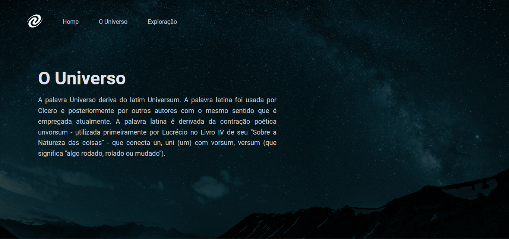

<h1 align="center"> Spa Universe </h1>

Os mistérios do universo...

 

  

  

  

## 🚀 Tecnologias

Esse projeto foi desenvolvido com as seguintes tecnologias:

- HTML e CSS
- JavaScript

## 💻 Projeto

O conteúdo do stage 06 sobre SPA (Single Page Application), clone e rode no terminal com "npm run web".  

---

 
  
  &nbsp;&nbsp;&nbsp;|&nbsp;&nbsp;&nbsp;
  
 

